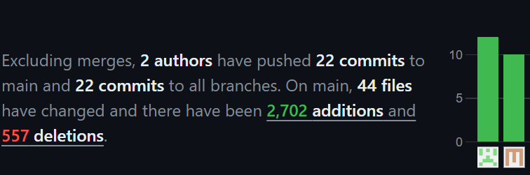
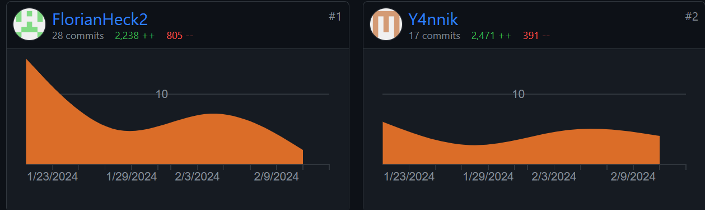
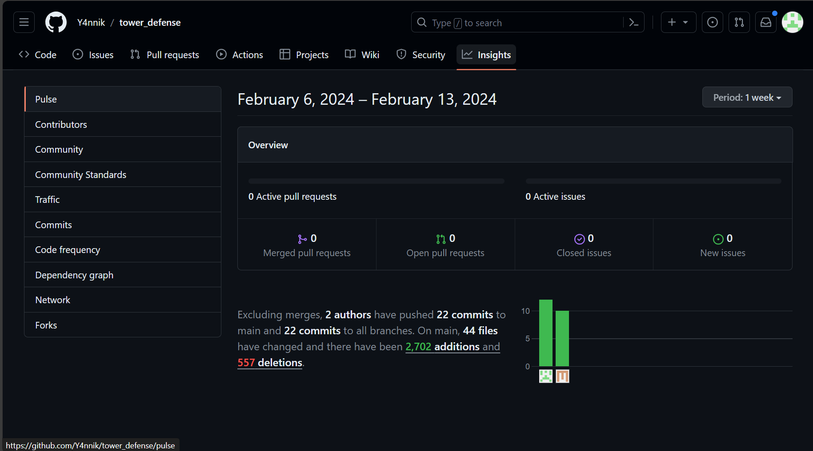
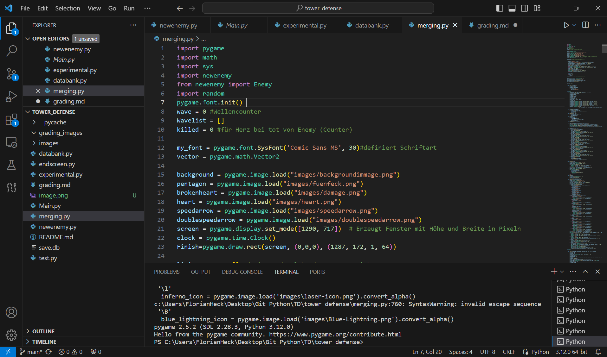
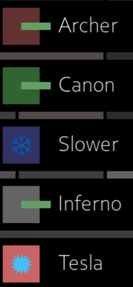

<!-- https://github.com/skills/communicate-using-markdown -->

# Grading Criteria Programmieren T3INF1004
In jedem Unterbereich werden die Punkte (gerne auch Links ins GIT) erklärt, wie das LO erreicht worden ist.
Alle Kriterien betreffen nur die Projektarbeit. Beweismaterial kommt aus dem Gruppenprojekt.

## FACHKOMPETENZ (40 Punkte)

# Die Studierenden kennen die Grundelemente der prozeduralen Programmierung. (10)
<!-- Siehe Kenntnisse in prozeduraler Programmierung: zutreffendes wählen und beweisen-->

# Sie können die Syntax und Semantik von Python (10)
<!-- Eine Stelle aus ihrem Programmieren wählen auf die sie besonders stolz sind und begründen -->
-Syntax: Die Syntax beschreibt eine richtige Nutzung der Grammatik einer Programmiersprache. Betrachtet man hierfür beispielsweiße die Funktion newWave() (https://github.com/Y4nnik/tower_defense/blob/03d695fe57b860809f7a5e19f6bafb7830caccfc/newenemy.py#L65-L96) Hier werden verschiedene if-Abfragen korrekt verwendet, es wird eine while-Schleife verwendet und Werte zu einer Liste hinzugefügt. Dabei ist besonders wichtig, dass die Einrückung korrekt verwendet wurde.
-Semantik: Mit der Semantik wird die "Bedeutung" des Codes gemeint. Ein Beispiel hierfür wäre die Klasse Enemy (https://github.com/Y4nnik/tower_defense/blob/03d695fe57b860809f7a5e19f6bafb7830caccfc/newenemy.py#L38-L49), in welcher Instanzen erstellt werden, welche wiederum Gegner repräsentieren und verschiedene Eigenschaften innehaben. Durch das hinzufügen zu EnemyCollection werden diese überwachbar und leicht zugreifbar.
# Sie können ein größeres Programm selbständig entwerfen, programmieren und auf Funktionsfähigkeit testen (Das Projekt im Team) (10)
<!-- Anhand von commits zeigen, wie jeder im Projekt einen Beitrag geleistet hat -->
-Beide hatten eine ähnliche Anzahl an Commits  https://github.com/Y4nnik/tower_defense/pulse
-Beide haben einen ähnlichen Umfang an Code implementiert  https://github.com/Y4nnik/tower_defense/graphs/contributors
# Sie kennen verschiedene Datenstrukturen und können diese exemplarisch anwenden. (10)
<!-- Eine Stelle aus dem Projekt wählen auf die sie besonders stolz sind und begründen -->
-Eine Datenstruktur, welche wir eingebaut haben, sind Datenbanken für Speicherstände (das Grundkonzept hierbei funktioniert, allerdings ist das Feature nicht voll ausgebaut und dementsprechend noch nicht im laufeden Spiel implementiert) https://github.com/Y4nnik/tower_defense/blob/03d695fe57b860809f7a5e19f6bafb7830caccfc/databank.py#L16-L36
-Außerdem wurden für verschiedene Zwecke Arrays (Listen) verwendet, z.b. um alle lebenden Türme gesammelt darzustellen, und die Liste durchgehen zu können, um ihre Funktionen darzustellen. (livingTowers = []  # darin werden lebende Türme gesichert)

## METHODENKOMPETENZ (10 Punkte)

# Die Studierenden können eine Entwicklungsumgebung verwenden um Programme zu erstellen (10)
<!-- Beweise anbringen für Nutzen folgender Tools (können links, screenshots und screnncasts sein) -->

<!-- zB -->
<!-- GIT -->
<!-- VSC -->
<!-- Copilot -->
<!-- other -->

## PERSONALE UND SOZIALE KOMPETENZ (20 Punkte)

# Die Studierenden können ihre Software erläutern und begründen. (5)
<!-- Jeder in der Gruppe: You have helped someone else and taught something to a fellow student (get a support message from one person) -->

# Sie können existierenden Code analysieren und beurteilen. (5)
<!-- Pro Gruppe:You have critiqued another group project. Link to your critique here (another wiki page on your git) and link the project in the critique, use these evaluation criteria to critique the other project. Make sure they get a top grade after making the suggested changes -->

# Sie können sich selbstständig in Entwicklungsumgebungen und Technologien einarbeiten und diese zur Programmierung und Fehlerbehebung einsetzen. (10)
<!-- Which technology did you learn outside of the teacher given input -->pygame, https://github.com/Y4nnik/tower_defense/blob/03d695fe57b860809f7a5e19f6bafb7830caccfc/merging.py#L1
<!-- Did you or your group get help from someone in the classroom (get a support message here from the person who helped you) -->

## ÜBERGREIFENDE HANDLUNGSKOMPETENZ (30 Punkte)

# Die Studierenden können eigenständig Problemstellungen der Praxis analysieren und zu deren Lösung Programme entwerfen (30)
<!-- Which parts of your project are you proud of and why (describe, analyse, link) --> große Auswahl verschiedener Türme [] und Gegner mit eigenen Designs(Eigene Grafiken: https://github.com/Y4nnik/tower_defense/tree/main/images),  
<!-- Where were the problems with your implementation, timeline, functionality, team management (describe, analyse, reflect from past to future, link if relevant) --> 
-Gerade am Anfang war eine gleichzeitige Arbeit am Projekt kaum möglich, da die Hauptfunktionen sich gegenseitig stark beeinflussten und es waren genaue Absprachen nötig, um sich nicht gegenseitig Steine in den Weg zu legen (am ersten Abend wurde z.B. der gleiche Code von beiden unterschiedlich verändert und es konnte nur die Arbeit des Einen verwendet werden); im weiteren Verlauf waren die Absprachen sehr gut und wir konnten gezielt Features erarbeiten, die der jeweils andere auch nutzen konnte.
-Ein Problem, an dem relativ lange gearbietet wurde, war eine Restart Funktion, welche wiederum in der Ursprünglichen Form viele andere Probleme hervorrief. Diese wurde dann gemeinsam nocheinmal betrachtet und so wurde schnell ein neuer Ansatz gefunden, mit welchem das Spiel wieder reibungslos lief. Daraus ergibt sich für uns, dass es sich bei Problemen anbietet, um Rat zu fragen, um eine neue Perspektive einzunehmen.

## Kenntnisse in prozeduraler Programmierung:

# - Algorithmenbeschreibung

# - Datentypen

# - E/A-Operationen und Dateiverarbeitung

# - Operatoren

# - Kontrollstrukturen

# - Funktionen

# - Stringverarbeitung

# - Strukturierte Datentypen

